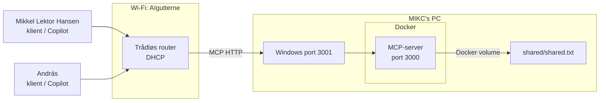

# MCP LAN-test med Docker, klienter og Copilot

Dette projekt er et lille forsøg med en fælles MCP-server på et lokalt netværk.

Målet er at undersøge, om **MIKC** kan køre én MCP-server i Docker på sin PC, mens **Mikkel Lektor Hansen** og **András** forbinder fra deres egne PC'er og læser/skriver i den samme tekstfil gennem MCP.

Det vigtige er, at klienterne **ikke får en Windows-share eller direkte adgang til filen**. De får kun adgang til de funktioner, som MCP-serveren udstiller.

## Hvad vil vi vise?

Vi vil teste fire ting:

1. At MCP-serveren kan køre isoleret i Docker på MIKC's PC.
2. At en klient på en anden PC kan nå MCP-serveren over et lokalt LAN.
3. At flere klienter kan læse og ændre den samme `shared.txt`.
4. At en AI-klient som GitHub Copilot kan bruge de samme MCP-tools.

Hvis testen lykkes, har vi et konkret eksempel på en **fælles MCP-service**, som flere AI-agenter kan bruge.

## Arkitektur



Routeren uddeler IP-adresser automatisk med DHCP.

Eksempel:

```text
MIKC:                 192.168.8.100
Mikkel Lektor Hansen: 192.168.8.101
András:               192.168.8.102
```

Adresserne er kun eksempler. MIKC's faktiske IP findes med `ipconfig`.

## Roller

### MIKC

MIKC er servermaskinen.

Her kører:

- Docker Desktop
- MCP-serveren
- port `3001` på Windows
- `shared/shared.txt`

MIKC skal altså starte serveren.

### Mikkel Lektor Hansen og András

Mikkel Lektor Hansen og András er klienter.

De skal **ikke** starte MCP-serveren og skal derfor **ikke køre**:

```powershell
npm start
```

Hvis man gør det, forsøger man at starte sin egen MCP-server lokalt. Det er derfor fejlen:

```text
MCP_TOKEN mangler. Opret en .env-fil ...
```

ikke er et problem for klienttesten.

På klient-PC'erne skal der kun være:

- Node.js
- projektet klonet
- `npm install` kørt
- en terminal/IDE
- senere evt. GitHub Copilot som MCP-klient

## Før workshoppen

Mikkel Lektor Hansen og András kan forberede:

```powershell
git clone https://github.com/krollchristensen/mcp-lan-file-server_mhan_anac.git
cd mcp-lan-file-server_mhan_anac
npm install
```

De behøver ikke Docker.

## Del 1 – MIKC tester lokalt først

Inden vi bruger LAN'et, tester MIKC hele kæden på sin egen PC.

### 1. Start Docker

Sørg for, at `.env` på MIKC's PC indeholder et MCP-token og mindst:

```env
MCP_TOKEN=<vores-token>
ALLOWED_HOSTS=localhost,127.0.0.1
```

Start serveren:

```powershell
docker compose down
docker compose up --build -d
```

Kontroller:

```powershell
docker compose ps
```

Der skal stå noget i retning af:

```text
0.0.0.0:3001->3000/tcp
```

Det betyder:

```text
Windows:3001
     ↓
Docker:3000
     ↓
MCP-server
```

### 2. Test HTTP

```powershell
curl.exe http://127.0.0.1:3001/health
```

Forventet svar:

```json
{"status":"ok"}
```

### 3. Test MCP-klienten lokalt

```powershell
$env:MCP_URL="http://127.0.0.1:3001/mcp"
$env:MCP_TOKEN="<vores-token>"
npm run client
```

Klienten:

1. forbinder til MCP-serveren
2. viser serverens tools
3. læser `shared.txt`
4. tilføjer en linje
5. læser filen igen

Serveren udstiller disse tools:

```text
read_text_file
write_text_file
append_text_file
```

Åbn derefter:

```text
shared/shared.txt
```

Hvis den nye linje står dér, virker den lokale kæde.

## Hvad gør Docker?

MCP-serveren arbejder inde i containeren med:

```text
/data/shared.txt
```

I `docker-compose.yml` er mappen koblet til værtsmaskinen:

```yaml
volumes:
  - ./shared:/data
```

Det betyder:

```text
Docker                    MIKC's PC

/data/shared.txt   <-->   ./shared/shared.txt
```

MCP-serveren er altså isoleret i Docker, men filen ligger fysisk på MIKC's PC.

Containeren kan genstartes uden at filens indhold forsvinder.

## Del 2 – Opret LAN'et

MIKC starter den trådløse router og opretter Wi-Fi:

```text
AIgutterne
```

Alle tre PC'er forbindes til dette netværk.

På MIKC's PC:

```powershell
ipconfig
```

Find IPv4-adressen på forbindelsen til `AIgutterne`.

Eksempel:

```text
192.168.8.100
```

MIKC opdaterer derefter `.env`:

```env
MCP_TOKEN=<vores-token>
ALLOWED_HOSTS=localhost,127.0.0.1,192.168.8.100
```

og genstarter:

```powershell
docker compose down
docker compose up --build -d
```

Test på MIKC's PC:

```powershell
curl.exe http://192.168.8.100:3001/health
```

Forventet:

```json
{"status":"ok"}
```

## Del 3 – Mikkel Lektor Hansen tester forbindelsen

På Mikkel Lektor Hansens PC:

```powershell
Test-NetConnection 192.168.8.100 -Port 3001
```

Vi vil se:

```text
TcpTestSucceeded : True
```

Hvis det virker, kører han klienten:

```powershell
$env:MCP_URL="http://192.168.8.100:3001/mcp"
$env:MCP_TOKEN="<vores-token>"
npm run client
```

MIKC åbner samtidig `shared/shared.txt` på sin PC.

Når klienten kører, skal der komme en ny linje i filen.

Det viser:

```text
Mikkel Lektor Hansens PC
          ↓
         LAN
          ↓
MIKC:3001
          ↓
       Docker
          ↓
     MCP-server
          ↓
     shared.txt
```

## Del 4 – András tester den samme server

András gør det samme:

```powershell
Test-NetConnection 192.168.8.100 -Port 3001
```

og derefter:

```powershell
$env:MCP_URL="http://192.168.8.100:3001/mcp"
$env:MCP_TOKEN="<vores-token>"
npm run client
```

Det interessante er, at András først bør kunne **læse den ændring, som Mikkel Lektor Hansen lige har lavet**.

Derefter tilføjer András' klient selv en ny linje.

Hvis begge ændringer kan ses i `shared.txt`, har vi vist, at to uafhængige klienter bruger samme MCP-server og samme datakilde.

## Del 5 – Test med Copilot

Når `npm run client` virker fra begge PC'er, tester vi med GitHub Copilot eller en anden MCP-kompatibel AI-klient.

Det er med vilje sidste trin.

Hvis Copilot fejler, men `npm run client` virker, ved vi allerede, at:

- LAN'et virker
- port 3001 virker
- Docker virker
- MCP-serveren virker
- tokenet virker
- den delte fil virker

Så er fejlen isoleret til AI-klientens MCP-konfiguration.

På MIKC's PC er MCP-adressen:

```text
http://127.0.0.1:3001/mcp
```

På Mikkel Lektor Hansens og András' PC'er er MCP-adressen:

```text
http://<MIKC-IP>:3001/mcp
```

Eksempel:

```text
http://192.168.8.100:3001/mcp
```

Når Copilot kan se MCP-serverens tools, kan vi fx bede den:

```text
Brug MCP-serveren til at læse den delte tekstfil.
```

Derefter:

```text
Brug MCP-serveren til at tilføje:
"Hej fra Mikkel Lektor Hansens Copilot"
```

og på András' PC:

```text
Brug MCP-serveren til at læse filen og tilføje:
"Hej fra András' Copilot"
```

MIKC kan se resultatet direkte i `shared/shared.txt`.

## Hvad har vi bevist, hvis det virker?

Hvis testen lykkes, kan vi konkludere:

- MCP-serveren behøver ikke køre på samme PC som klienten.
- Én MCP-server kan bruges af flere klienter.
- Docker kan bruges til at isolere MCP-serverens runtime.
- Docker-volume giver serveren kontrolleret adgang til en fil på værtsmaskinen.
- Mikkel Lektor Hansen og András behøver ikke direkte adgang til MIKC's filsystem.
- Klienterne får kun de capabilities, MCP-serveren udstiller.
- En AI-agent kan bruge samme fælles MCP-server som en almindelig MCP-testklient.

Det centrale er altså ikke selve tekstfilen. Den er bare vores simple bevis.

Senere kunne samme princip bruges til fx:

- dokumenter
- databaser
- REST API'er
- Git
- interne systemer
- fælles værktøjer for AI-agenter

## Hvad har vi ikke bevist?

Forsøget er en prototype på et lukket LAN.

Det viser ikke endnu:

- produktionssikkerhed
- interneteksponering
- mange samtidige brugere
- avanceret rettighedsstyring
- håndtering af samtidige writes
- robusthed ved netværksfejl

Det kan være næste eksperiment.

## Fejlfinding

Hvis Mikkel Lektor Hansen eller András ikke kan nå serveren:

```powershell
Test-NetConnection <MIKC-IP> -Port 3001
```

Hvis resultatet er:

```text
TcpTestSucceeded : False
```

kontroller:

- at alle er på `AIgutterne`
- at MIKC's IP er korrekt
- at Docker-containeren kører
- at port `3001` er eksponeret
- Windows Firewall
- at `ALLOWED_HOSTS` indeholder MIKC's LAN-IP

På MIKC's PC:

```powershell
docker compose ps
docker compose logs
```

## Kort workshop-rækkefølge

```text
1. MIKC tester localhost
        ↓
2. Alle forbinder til AIgutterne
        ↓
3. MIKC finder sin DHCP-IP
        ↓
4. MIKC genstarter Docker med LAN-IP i ALLOWED_HOSTS
        ↓
5. Mikkel Lektor Hansen tester port 3001
        ↓
6. Mikkel Lektor Hansen kører npm run client
        ↓
7. Vi ser ændringen i shared.txt
        ↓
8. András kører npm run client
        ↓
9. Vi ser begge ændringer i shared.txt
        ↓
10. Vi tester Copilot mod samme MCP-server
```
